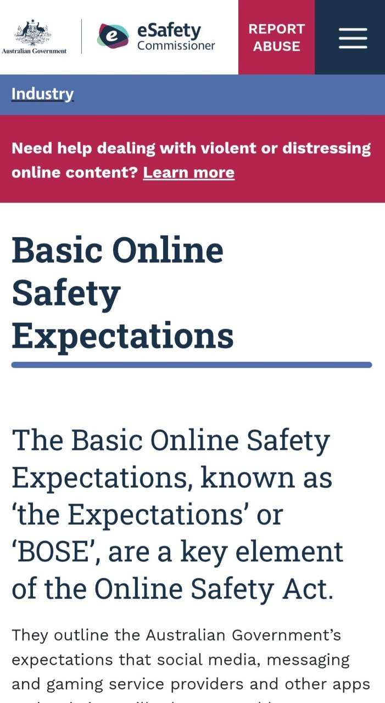
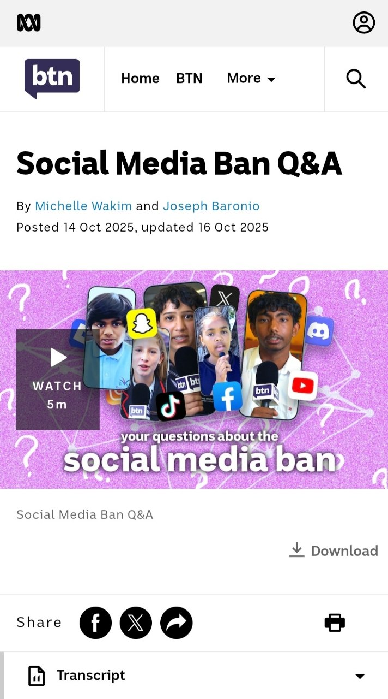
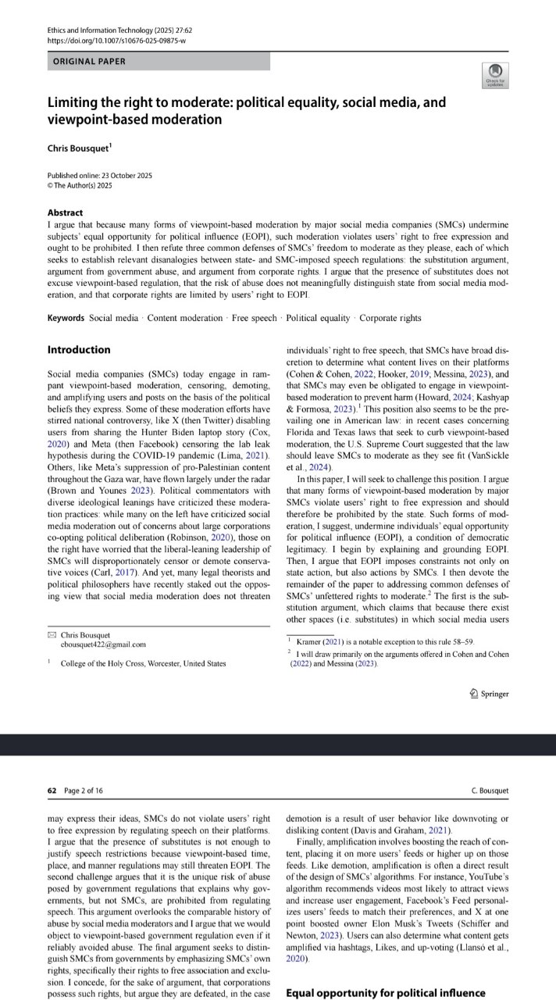
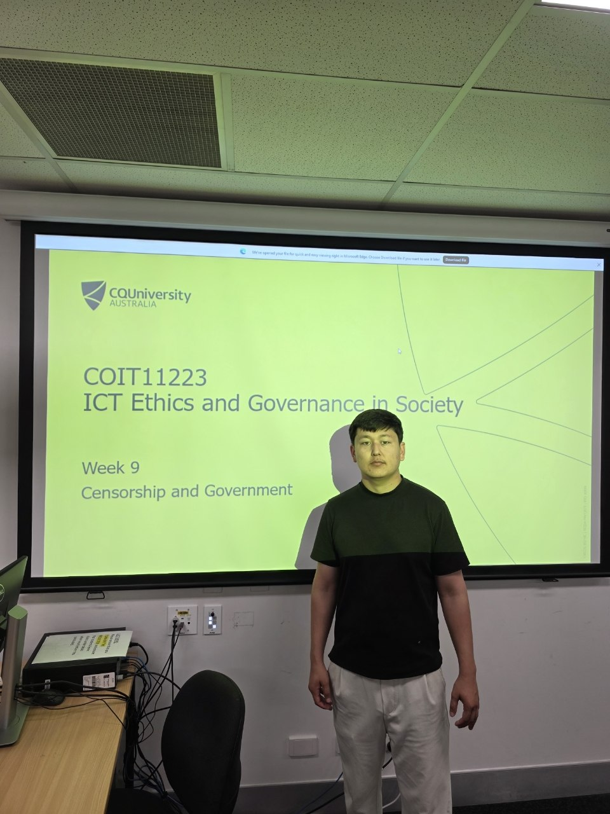

# COIT11223-e-portfolio-4
COIT11223 e-Portfolio 4 – Censorship and Government
> **Disclaimer:** This is my e-portfolio for COIT11223 ICT Ethics and Governance in Society and is used for educational purposes.

# e-portfolio-4-Censorship-and-Government

A collection of artefacts that demonstrate what I have learnt about Censorship and Government this week.

## Artefact 1: Australian Government regulation of online content

Source: https://www.esafety.gov.au/industry/basic-online-safety-expectations

### Summary of the artefact

The ‘Basic Online Safety Expectations’ page of the eSafety Commissioner explains how the Australian Government regulates online services under the Online Safety Act.
Social media, messaging, gaming and other online providers are expected to do what they reasonably can to protect the safety of Australians. This includes being able to ask providers to provide reports about how well they’ve met these requirements (eSafety Commissioner 2026).

### Justification on why I chose the artefact

The reason I decided to select this artefact was to gain insight into the idea of how government could be involved with online content – more than just removing stuff.
It highlights things like rules, transparency & accountability which have relevance to concepts like censorship as well as potentially influencing what you do or don’t see on-line while protecting against some major harms.
The part that jumped out at me here was around the issue of transparency since it’s important for us as ICT professionals to think about things like accountability when dealing with digital systems.
---

## Artefact 2: ABC News – Social Media Ban Q&A

Source: https://www.abc.net.au/btn/high/social-media-ban-q-a/105892142

### Summary of the artefact

This ABC Behind the News video describes the social media age restriction policies of Australia, which apply to those aged less than 16 years. 
It includes questions posed by young people with answers provided by the eSafety commissioner regarding rationales behind these rules, which apply to specific platforms, aspects such as ‘age-assurance’ and privacy. This includes an explanation that the responsibility lies with platforms – rather than penalties being imposed upon under 16-year-old users (Wakim & Baronio 2025).

### Justification on why I chose the artefact

The reason why I selected this artefact is that it highlights how government regulation affects our every day usage of digital communications.
What struck me about this article was the balance of competing priorities within government policy around safety versus privacy and accessibility for members of online communities.
I had always considered censorship of information as blocking information but seeing this method demonstrated taught me more about regulations beyond just content filtering. As an ICT Professional you have to be aware of not only what you are trying to protect people from but also potential negative side effects on society at large.
---

## Artefact 3: Scholarly Article

Source: https://link.springer.com/article/10.1007/s10676-025-09875-w

### Summary of the artefact
In this scholarly article Bousquet talks about censorship, demotion and amplification by social media companies and discusses their relationship with free expression.
He introduces the concept of “Equal Opportunity for Political Influence” arguing that “viewpoint based moderation can affect people's opportunities to engage in political discussion” (Bousquet 2025, p. 2).
This paper distinguishes between direct censorship, which includes decreasing the reach of some contents and demotion.

### Justification on why I chose the artefact

I selected this particular article to understand better how censorship is defined beyond content deletion.
The article’s explanation of the difference between censorship and demotion gave me an appreciation for how censoring/deleting information may have different impacts on public communication than merely restricting the amount of information reaching a user.
Understanding these distinctions allowed me to further explore the potential role of Information Communication Technology (ICT) governance and its impact on public communication through technical decisions.

---

## Artefact 4: Workshop Personal Reflection

**Workshop:** Week 9 – Censorship and Government

**Tutor:** *(Khaleel Petrus)*

**Campus:** Brisbane

**Date:** *(Tuesday 15th Sep 2026)*

### Summary of the artefact
The aim of this workshop session was to discuss the ways in which governments and online platforms have control over restricting online content.
When discussing with our tutor and fellow class members during week nine there were many examples brought up.
For instance, there are age restrictions when accessing social media sites. In these cases, governments attempt to safeguard their young citizens from having unrestricted online communication.
Another case involved removal of content deemed harmful or illegal, as well as online platform taking more accountability regarding user’s safety. It was interesting to note that everyone views certain restrictions differently – what one group perceives as an act of safety could be seen another perspective as a limit on freedom to access information.

### Justification on why I chose the artefact
One reason for choosing this particular workshop discussion was its relevance to the way we perceive issues such as censorship. Prior to reading up on this topic, I had generally considered censorship as being the result of Governments acting against the flow of information.
However, after participating in this discussion, I now understand that censorship and regulation are far more nuanced than this simplistic view suggests. It is interesting to learn how even an act such as restricting access to social media could impact our privacy, freedoms of expression and accessibility of information. 
This issue clearly resonated with me as someone who plans on entering the ICT industry. As technology professionals we will most likely be playing some part in designating, managing or implementing systems which incorporate rules such as those discussed during this session. This experience has highlighted the importance of considering all aspects when making technical decisions – namely ensuring that we are conscious of both positive impacts as well as potential negative outcomes of regulating technology.

---

# References in CQU Harvard Style

Bousquet, C 2025, *Limiting the right to moderate: political equality, social media, and viewpoint-based moderation*, Ethics and Information Technology, vol. 27, article 62.

eSafety Commissioner 2026, *Basic Online Safety Expectations*, Australian Government, viewed 20 September 2026, https://www.esafety.gov.au/industry/basic-online-safety-expectations.

Wakim, M & Baronio, J 2025, *Social Media Ban Q&A*, ABC Behind the News, viewed 20 September 2026, https://www.abc.net.au/btn/high/social-media-ban-q-a/105892142.

# AI Use Statement
During the planning & research phase of this activity, I have used AI to find relevant artefacts and organisation ideas.
To ensure accuracy and consistency with the source material, I have checked the information from these sources and revised and edited the content appropriately, ensuring that it reflects my own learning and understanding.
To ensure accuracy and consistency with the source material, I have checked the information from these sources and revised and edited the content appropriately, ensuring that it reflects my own learning and understanding.
